# CERT-Copilot

AI 기반 사이버 방어 훈련 및 운영 보조 데모입니다. 교육생은 합성 시나리오에서 보안 장비 형태의 목업 데이터를 조회하고, 근거를 pin한 뒤 판단을 제출합니다. 같은 evidence model은 운영 대시보드와 헬프데스크 화면에서도 재사용되어 사건, 사후강평, 문의 해결 기록이 지식으로 축적되는 흐름을 보여 줍니다.


## 핵심 요약

CERT-Copilot은 사이버 방어 교육을 단순 지식 퀴즈가 아니라 **근거 수집 -> 상황 판단 -> 승인 기반 조치 제안 -> 사후강평 -> 지식 축적**의 반복 훈련으로 재구성한 해커톤 결과물입니다. 훈련 화면, 운영 대시보드, 헬프데스크가 같은 evidence ledger와 knowledge model을 공유하기 때문에, 교육에서 나온 판단 과정이 운영 지식으로 남고 운영 중 축적된 지식은 다시 다음 훈련과 답변의 근거가 됩니다.

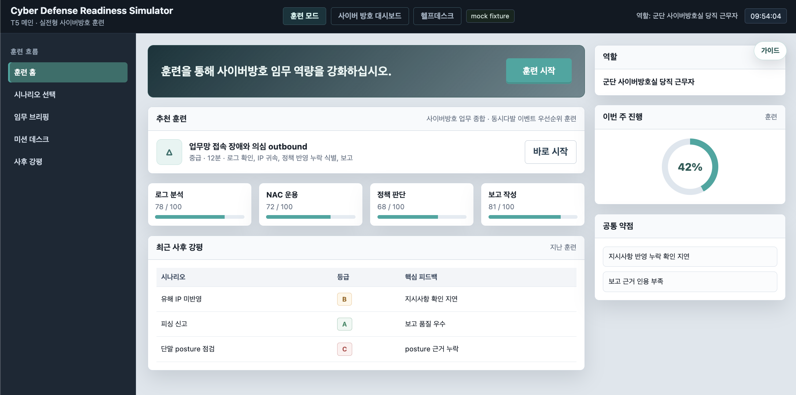

| 항목 | 내용 |
|---|---|
| 제출 방향 | AI 기반 사이버 방어 교육훈련 자동화 |
| 핵심 사용자 | 사이버 방어 교육생, 교관, 보안 관제/운영 담당자 |
| 핵심 가치 | 여러 보안 단서를 연결하는 판단 훈련과 조직 지식 축적 |
| 구현 형태 | FastAPI + SQLite backend, vanilla HTML/CSS/JS frontend |
| 안전 원칙 | synthetic/masked data, 근거 기반 답변, 조치 자동 실행 금지 |

## 문제 정의

사이버 방어 업무에서 어려운 부분은 특정 보안 도구 하나를 아는 것이 아니라, 서로 다른 출처의 단서를 연결해 **우선순위와 조치 방향을 판단하는 일**입니다. 로그, 자산 정보, 보안 정책, 외부 위협 인텔, 사용자 문의가 동시에 들어오면 담당자는 제한된 시간 안에 사실관계를 확인하고, 근거가 부족한 추정을 걸러내며, 실행 가능한 조치와 승인 필요한 조치를 분리해야 합니다.

기존 교육은 개념 설명이나 단일 과제 풀이에 머무르기 쉽습니다. 그 결과 교육생은 실제 업무와 비슷한 복합 상황에서 어떤 근거를 먼저 확인해야 하는지, 어떤 판단이 과도한 자동화인지, 어떤 기록을 남겨야 다음 담당자가 이어받을 수 있는지 반복 연습하기 어렵습니다. CERT-Copilot은 이 공백을 **방어적 시나리오 기반 훈련**과 **근거 중심 운영 보조**로 해결합니다.

## KPI와 평가 기준

CERT-Copilot의 평가는 단순 정답률보다 방어 업무에 필요한 판단 속도, 근거 수집, 승인 절차 준수, 지식 축적 가능성에 맞춰져 있습니다. 아래 수치는 해커톤 MVP가 목표로 삼는 기대 효과이며, 실제 조직 적용 시에는 기관별 기준선 측정 후 보정합니다.

| 핵심 KPI | 기대 수치 | 제품에서 보이는 방식 |
|---|---|---|
| Readiness Score | 2회 반복 훈련 후 시나리오 완주율 80% 이상 | AAR 점수, 등급, 다음 추천 훈련 |
| Time to Triage | 최초 브리핑부터 핵심 사건 분류까지 30% 단축 | 미션 시작·근거 조회·대응 제출 timestamp 비교 |
| Evidence Coverage | 필수 근거 4종 중 3종 이상 pin 비율 85% 이상 | pin한 evidence와 놓친 evidence 비교 |
| Decision Quality | 교관 rubric 기준 적정 우선순위·심각도 판단 75% 이상 | 동적 rubric, 평가 preview, AAR 피드백 |
| Response Safety | write-like action 자동 실행 0건, 승인 대기 처리 100% | `approval_required`, `executed=false` 강제 |
| Knowledge Retention | 종결 사건·훈련·문의의 지식 후보 전환율 70% 이상 | Knowledge DB 축적, 검색, FAQ 후보 등록 |
| Grounded Assistance | AI 답변 citation 포함률 95% 이상, 근거 부족 시 차단 100% | citation 기반 답변, 근거 부족 응답 |

## 접근 방식

1. **Training Mode**  
   교육생은 시나리오를 선택하고 mission desk에서 UTM/FW, NAC, directive, threat-intel 형태의 목업 포트를 조회합니다. 확인한 근거를 pin하고 판단을 제출하면 AAR에서 조사 경로, 누락 근거, 판단 품질을 확인합니다.

   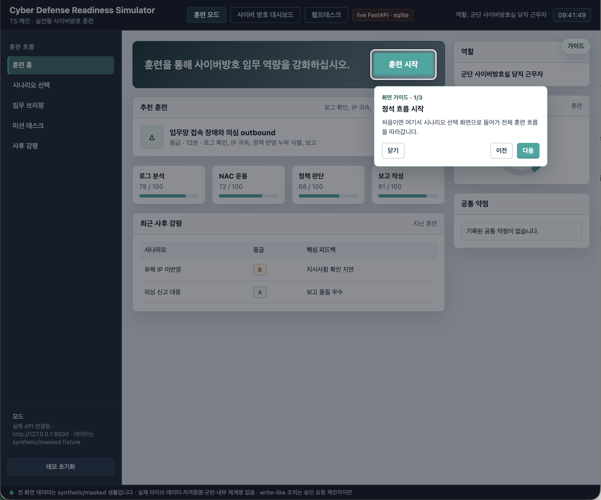

   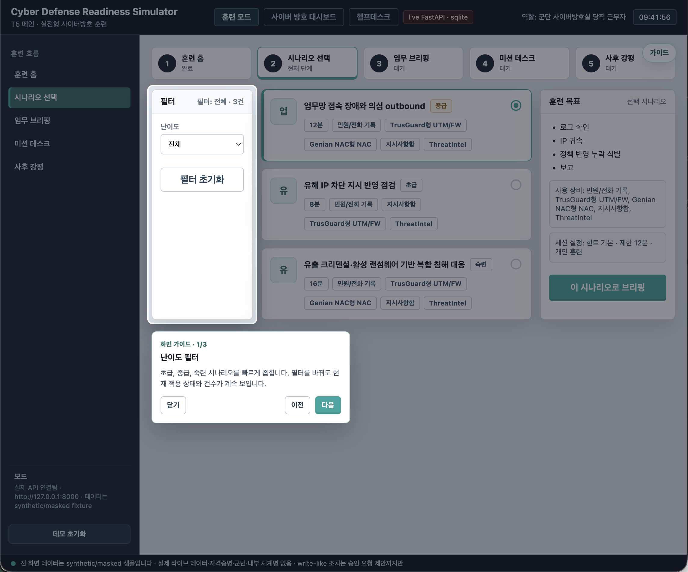

   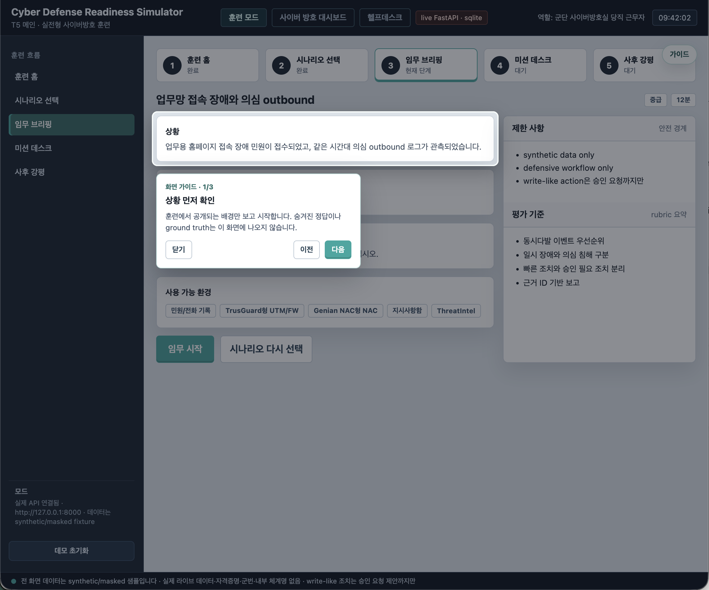

   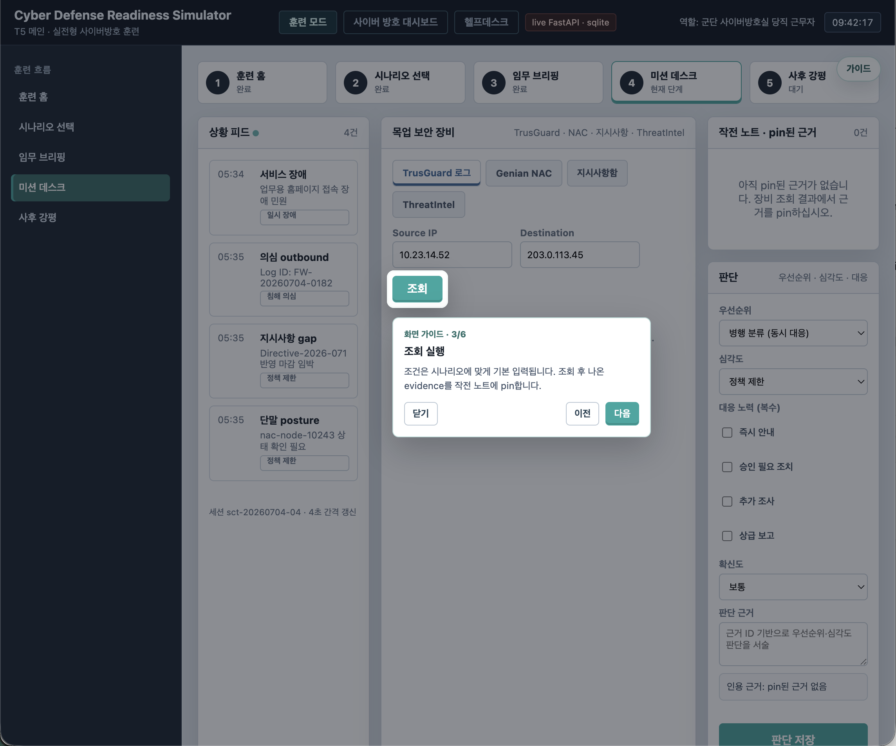

   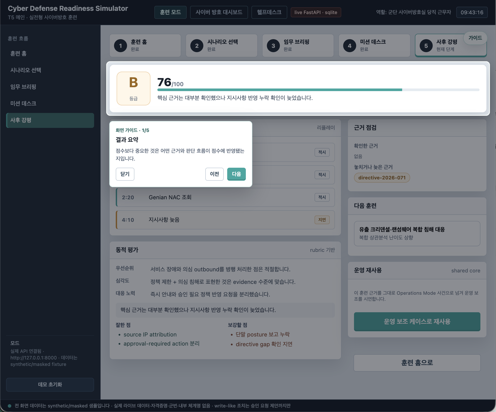

2. **Shared Evidence Core**  
   화면별 데이터를 따로 만들지 않고 `Evidence Ledger`, scenario/session objects, recommendation objects를 공통 계약으로 설계했습니다. 덕분에 훈련 결과를 운영 case로 재사용하고, 운영 중 생긴 사건과 문의를 다시 지식으로 축적할 수 있습니다.

3. **Operations Dashboard**  
   합성 사건 접수, 알림, 상태 전이, 지식 검색을 통해 같은 코어가 운영 보조에도 쓰일 수 있음을 보여 줍니다. 모든 write-like action은 실제 실행이 아니라 승인 대기 제안으로만 기록됩니다.

   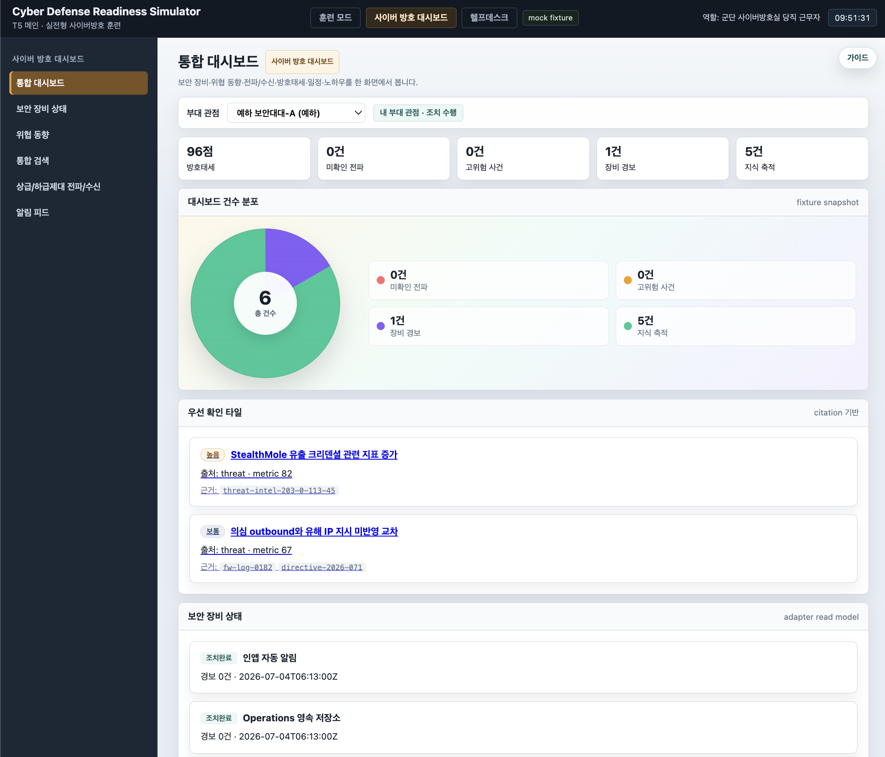

   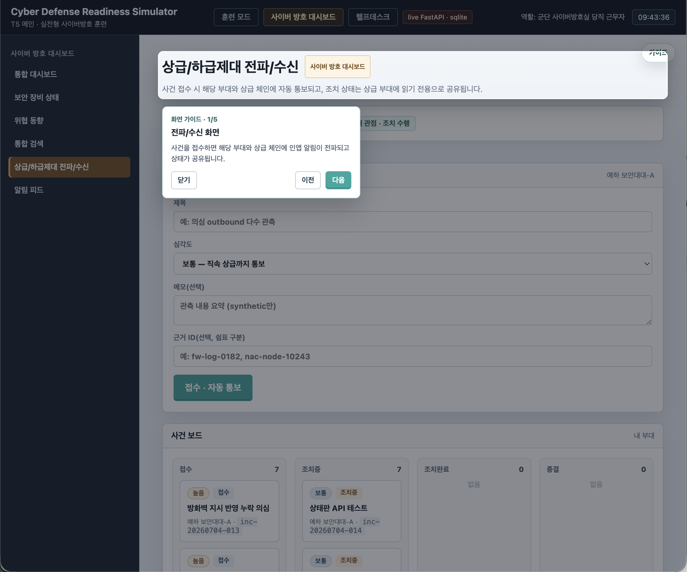

4. **Helpdesk Mode**  
   문의를 분류하고 Knowledge DB에서 관련 근거를 찾은 뒤 citation이 있을 때만 답변 초안을 생성합니다. 관련 근거가 부족하면 답변을 생성하지 않아 환각 위험을 줄입니다.

   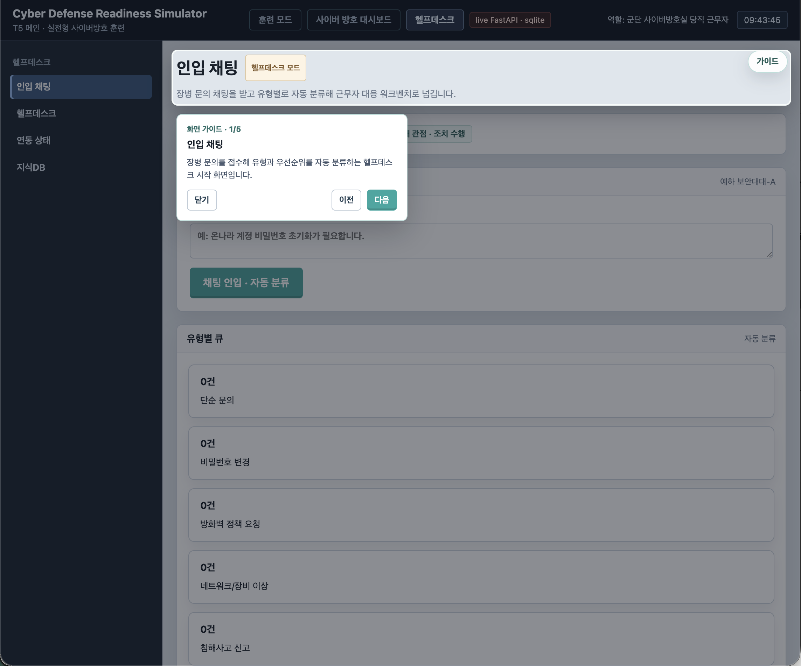

5. **Adapter-First 설계**  
   외부 체계 연동은 fixture, mock, live-readonly, approval-gated 모드로 교체 가능한 adapter 뒤에 둡니다. 해커톤 데모는 안전한 합성 데이터로 동작하고, 이후 실제 테스트 환경이 생겨도 계약을 유지하며 확장할 수 있습니다.

## 내부망 배포를 염두에 둔 공통 아키텍처

이 저장소의 현재 구현은 해커톤 데모 범위에 맞춰 FastAPI, SQLite, mock fixture를 중심으로 구성되어 있습니다. 다만 솔루션의 핵심 가치는 특정 클라우드 API나 단일 저장소에 묶이지 않도록 **LLM, DB, 검색, 보안 체계 연동을 Port로 분리한 공통 아키텍처**를 전제로 설계했다는 점입니다.

국방망처럼 외부 인터넷 의존을 최소화해야 하는 업무망에서는 OpenAI Compatible API endpoint를 제공하는 내부 Local LLM 서버를 붙이고, DB와 검색 엔진도 기관 내부 표준 제품으로 교체할 수 있어야 합니다. CERT-Copilot은 이 방향을 위해 애플리케이션 로직이 모델·저장소·검색·장비 연동 구현체를 직접 알지 않고, `LLM Port`, `DB Port`, `Search Port`, `System Adapter Port`를 통해 호출하는 구조를 목표로 합니다.

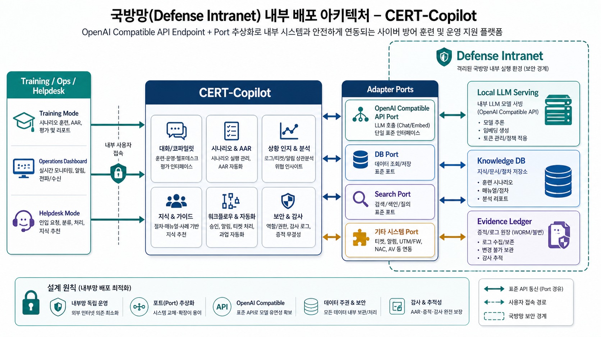

이 구조에서 Training Mode, Operations Dashboard, Helpdesk Mode는 같은 Evidence Ledger와 Knowledge DB 계약을 사용합니다. 따라서 데모에서는 SQLite와 fixture로 동작하더라도, 내부 배포 단계에서는 아래 구성으로 대체할 수 있습니다.

| Port | 데모 구성 | 내부망 배포 시 대체 대상 |
|---|---|---|
| LLM Port | mock/citation rule 또는 외부 API 연동 가능 지점 | OpenAI Compatible API를 제공하는 내부 Local LLM serving |
| DB Port | SQLite | 내부 PostgreSQL, 기관 표준 RDBMS, 별도 감사 저장소 |
| Search Port | fixture 기반 조회 | 내부 검색 엔진, 벡터 검색, 문서 검색 시스템 |
| System Adapter Port | synthetic NAC/UTM/directive/ThreatIntel fixture | NAC, UTM/FW, AV, IAM, 지시사항함, 티켓/알림 체계 |

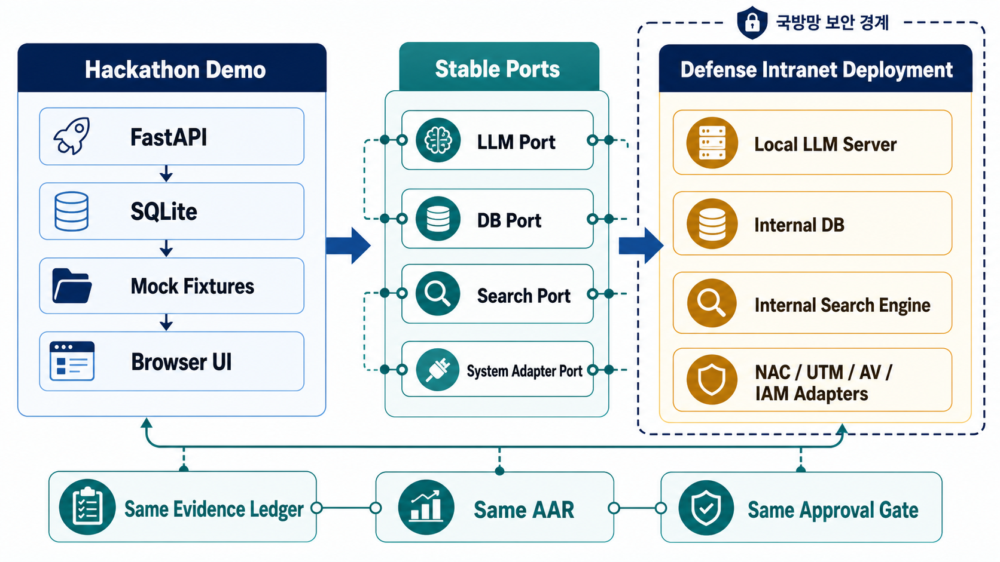

이 접근은 단순히 “데모가 돌아간다”를 넘어서, 실제 업무망 반입 시 중요한 조건을 미리 분리합니다.

- 모델은 OpenAI Compatible API 규격을 기준으로 교체 가능하게 둡니다.
- 데이터는 내부망에 남기고, 외부 전송 없이 조회·검색·감사 흐름을 구성할 수 있게 합니다.
- DB와 검색 엔진은 제품 고정이 아니라 port 구현체로 선택할 수 있게 합니다.
- NAC, UTM/FW, AV, IAM 같은 체계는 live-readonly부터 시작하고, write-like action은 approval-gated proposal로만 다룹니다.
- 훈련 사후강평, 운영 사건, 헬프데스크 문의는 같은 Evidence Ledger에 남아 감사와 인수인계에 재사용됩니다.

## 기대 방향성

- 교육생은 단편 지식 암기보다 **근거 기반 판단 루프**를 반복 숙달할 수 있습니다.
- 교관은 AAR에서 교육생이 무엇을 봤고 무엇을 놓쳤는지 evidence 단위로 피드백할 수 있습니다.
- 운영 조직은 사건, 사후강평, 문의 해결 기록을 지식DB로 축적해 인수인계 비용을 줄일 수 있습니다.
- AI는 자동 조치자가 아니라 **근거를 정리하고 승인 흐름을 보조하는 안전한 코파일럿**으로 작동합니다.
- 하나의 공통 모델을 훈련과 운영에 함께 쓰기 때문에, 해커톤 이후에도 실제 교육 콘텐츠와 운영 지원 기능을 같은 방향으로 확장할 수 있습니다.

## What Is Included

- FastAPI backend with SQLite persistence.
- Vanilla HTML/CSS/JS frontend.
- Training Mode: scenario selection, mission desk, evidence pinning, assessment, AAR.
- Cyber Defense Dashboard: synthetic incident intake, notification flow, status board, knowledge search.
- Helpdesk Mode: inquiry classification, citation-based answers, FAQ knowledge capture.
- Mock/live switch through `app/js/config.js`.
- Safety-oriented fixtures: synthetic or masked data only, no automatic write-like actions.

## Safety Boundaries

- This repository is a public hackathon artifact.
- All default data is synthetic or masked.
- No credentials, real personal identifiers, internal network values, or real system logs are required.
- Policy changes, endpoint isolation, and account actions are represented only as approval-required proposals.
- Threat-intelligence collection is optional and uses environment variables from `.env`; raw collection output is git-ignored.

## Backend Setup

```bash
uv sync --frozen
uv run python -m unittest discover -s tests
uv run uvicorn d4d.api.main:app --host 127.0.0.1 --port 8000
```

The API is available at `http://127.0.0.1:8000`.

You can also run the backend container:

```bash
docker build -t cert-copilot-backend .
docker run --rm -p 8000:8000 cert-copilot-backend
```

## Frontend Setup

In a second terminal:

```bash
cd app
python3 -m http.server 5173
```

Open `http://127.0.0.1:5173`.

`app/js/config.js` controls the frontend data source:

```js
API_BASE: "http://127.0.0.1:8000" // FastAPI backend
API_BASE: null                     // browser-only mock mode
```

## Demo Flow

1. Open Training Mode and start a recommended scenario.
2. Review the mission briefing and enter the mission desk.
3. Query UTM/FW, NAC, directive, and threat-intel mock ports.
4. Pin evidence, save an assessment, and submit the response.
5. Review the AAR timeline, missed evidence, and rubric feedback.
6. Reuse the result as an operations case.
7. Open the dashboard and helpdesk screens to see the same evidence and knowledge model reused.

## Project Structure

```text
app/          Frontend app
src/d4d/      FastAPI app, services, repositories, fixtures
tests/        Backend and contract tests
architecture/ Public API and adapter design notes
assets/       Public diagrams and images
```

## Useful Commands

```bash
# backend tests
uv run python -m unittest discover -s tests

# real-server e2e test
uv run python -m unittest tests.test_api_real_server_e2e

# frontend safety scan
node app/tools/safety-scan.js
```

## Environment

Copy `.env.tmpl` to `.env` only when you need optional live integrations. The demo works without live credentials.
