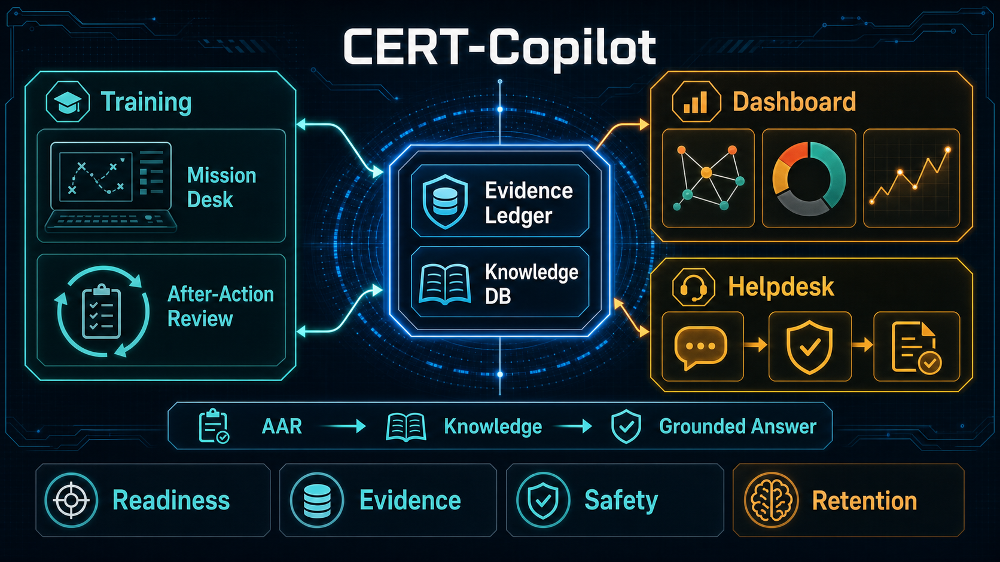

# CERT-Copilot

AI 기반 사이버 방어 훈련 및 운영 보조 데모입니다. 교육생은 합성 시나리오에서 보안 장비 형태의 목업 데이터를 조회하고, 근거를 pin한 뒤 판단을 제출합니다. 같은 evidence model은 운영 대시보드와 헬프데스크 화면에서도 재사용되어 사건, 사후강평, 문의 해결 기록이 지식으로 축적되는 흐름을 보여 줍니다.



## What Is Included

- FastAPI backend with SQLite persistence.
- Vanilla HTML/CSS/JS frontend.
- Training Mode: scenario selection, mission desk, evidence pinning, assessment, AAR.
- Cyber Defense Dashboard: synthetic incident intake, notification flow, status board, knowledge search.
- Helpdesk Mode: inquiry classification, citation-based answers, FAQ knowledge capture.
- Mock/live switch through `app/js/config.js`.
- Safety-oriented fixtures: synthetic or masked data only, no automatic write-like actions.

## Safety Boundaries

- This repository is a public hackathon artifact.
- All default data is synthetic or masked.
- No credentials, real personal identifiers, internal network values, or real system logs are required.
- Policy changes, endpoint isolation, and account actions are represented only as approval-required proposals.
- Threat-intelligence collection is optional and uses environment variables from `.env`; raw collection output is git-ignored.

## Backend Setup

```bash
uv sync --frozen
uv run python -m unittest discover -s tests
uv run uvicorn d4d.api.main:app --host 127.0.0.1 --port 8000
```

The API is available at `http://127.0.0.1:8000`.

You can also run the backend container:

```bash
docker build -t cert-copilot-backend .
docker run --rm -p 8000:8000 cert-copilot-backend
```

## Frontend Setup

In a second terminal:

```bash
cd app
python3 -m http.server 5173
```

Open `http://127.0.0.1:5173`.

`app/js/config.js` controls the frontend data source:

```js
API_BASE: "http://127.0.0.1:8000" // FastAPI backend
API_BASE: null                     // browser-only mock mode
```

## Demo Flow

1. Open Training Mode and start a recommended scenario.
2. Review the mission briefing and enter the mission desk.
3. Query UTM/FW, NAC, directive, and threat-intel mock ports.
4. Pin evidence, save an assessment, and submit the response.
5. Review the AAR timeline, missed evidence, and rubric feedback.
6. Reuse the result as an operations case.
7. Open the dashboard and helpdesk screens to see the same evidence and knowledge model reused.

## Project Structure

```text
app/          Frontend app
src/d4d/      FastAPI app, services, repositories, fixtures
tests/        Backend and contract tests
architecture/ Public API and adapter design notes
assets/       Public diagrams and images
```

## Useful Commands

```bash
# backend tests
uv run python -m unittest discover -s tests

# real-server e2e test
uv run python -m unittest tests.test_api_real_server_e2e

# frontend safety scan
node app/tools/safety-scan.js
```

## Environment

Copy `.env.tmpl` to `.env` only when you need optional live integrations. The demo works without live credentials.
