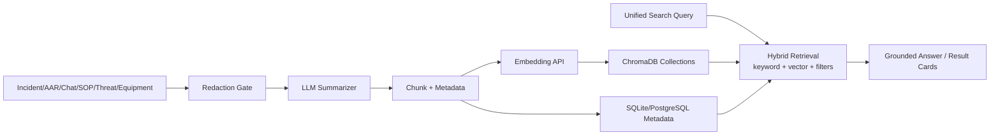
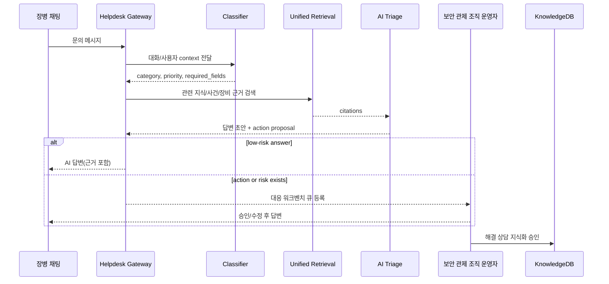

# 모드 재편 설계 — 사이버 방호 대시보드 + 헬프데스크 모드

> 상태: 설계 완료
> 최종 업데이트: 2026-07-05 KST
> 기반: `OPERATIONS_MODE_DESIGN.md`, `OPS_INCIDENT_FLOW_DESIGN.md`, `WORK_SUPPORT_KNOWLEDGE_DESIGN.md`, `API_SPEC.md`, `SERVICE_ARCHITECTURE_BLUEPRINT.md`
> 전제: OpenAI 호환 LLM API, Embedding API, ChromaDB 계열 벡터 검색 엔진이 사용 가능하다. 데모 데이터는 synthetic/masked only.

## 1. 핵심 결정

기존 2모드 구조를 3모드로 재편한다.

| 기존 | 신규 | 역할 |
|---|---|---|
| 훈련 모드 | 훈련 모드 | 시나리오 훈련, 근거 수집, 판단 제출, AAR |
| 실제 상황 모드 | 사이버 방호 대시보드 | 보안 관제 조직 통합 관제, 전파/수신, 장비/위협/태세/일정/지식 검색 |
| 실제 상황 모드 안의 업무 지원 | 헬프데스크 모드 | 장병 문의 채팅 인입, 자동 분류, AI/운영자 대응, 상담 이력 지식화 |

명칭 변경:

- `실제 상황 모드` -> `사이버 방호 대시보드`
- `상황판` -> `상위 조직/하급제대 전파/수신`
- `업무 지원/문의 답변` -> 별도 `헬프데스크 모드`
- `지식DB`와 `통합 검색`은 사이버 방호 대시보드에 위치한다. 다른 화면의 검색 UI는 이 통합 검색으로 deep-link만 한다.

## 2. 제품 정보구조

### 2.1 상단 모드

```text
훈련 모드 | 사이버 방호 대시보드 | 헬프데스크 모드
```

- 훈련 모드: 기존 라우트 유지.
- 사이버 방호 대시보드: 기존 `/ops/*`, `/knowledge` 기능을 전문 관제 화면으로 재구성.
- 헬프데스크 모드: 기존 `/helpdesk` 단일 문의 폼을 채팅 인입/분류/상담 워크벤치로 확장.

### 2.2 사이버 방호 대시보드 LNB

| 메뉴 | 기본 라우트 | 내용 |
|---|---|---|
| 통합 대시보드 | `#/dashboard` | 장비 상태, 위협 동향, 전파/수신 요약, 사이버방호태세, 일정, 지식 축적 KPI |
| 상위 조직/하급제대 전파/수신 | `#/dashboard/propagation` | 기존 상황판/알림/상태판. 접수, 전파, 수신 확인, 상태 공유 |
| 보안 장비 상태 | `#/dashboard/equipment` | UTM/FW, NAC, 지시사항함, ThreatIntel, 단말/백신 태세 adapter 상태 |
| 위협 동향 | `#/dashboard/threats` | StealthMole 기반 masked 위협 트렌드, 관련 IOC/캠페인 요약 |
| 사이버방호태세 | `#/dashboard/posture` | 조직별 정책 반영률, NAC posture, 유해 IP 지시 준수, 미해결 위험 |
| 일정/임무 | `#/dashboard/calendar` | 점검 일정, 지시사항 마감, 보고/훈련/패치 일정 |
| 노하우 지식DB | `#/dashboard/knowledge` | 단기 운영자 노하우, 사건/AAR/상담 축적 지식, 수동 등록 |
| 통합 검색 | `#/dashboard/search` | 시스템 전체의 유일한 검색 진입점. 지식DB, 사건, 상담, 위협, 장비 근거 검색 |

### 2.3 헬프데스크 모드 LNB

| 메뉴 | 기본 라우트 | 내용 |
|---|---|---|
| 인입 채팅 | `#/helpdesk/inbox` | 장병 문의 채팅 stream, 미배정/AI 처리중/운영자 응대중 상태 |
| 상담 대기열 | `#/helpdesk/queue` | 자동 분류 결과별 큐, SLA, 위험도, 필요한 확인 데이터 |
| 대응 워크벤치 | `#/helpdesk/conversations/:id` | 대화, 사용자/계정 검증, 관련 지식, 추천 답변, action proposal |
| 자동화/분류 규칙 | `#/helpdesk/rules` | 문의 유형, AI 가로채기 기준, 승인 필요 기준 |
| 상담 이력 | `#/helpdesk/history` | 종료된 상담, 재오픈, 지식DB 등록 후보 |
| 연동 상태 | `#/helpdesk/integrations` | 채팅 인입 API, IAM, NAC, UTM/FW, 지식 검색, LLM 상태 |

## 3. 사이버 방호 대시보드 메인 화면

메인 화면은 "실제 데이터가 들어오는 전문 통합 관제판"처럼 보여야 한다. 모든 수치는 source/citation이 있어야 하며,
demo에서는 synthetic/masked fixture임을 작은 배지로 표시한다.

권장 위젯:

| 영역 | 위젯 | 데이터 소스 |
|---|---|---|
| 상단 KPI | 방호태세 점수, 미확인 전파, 고위험 사건, 장비 경보, 지식 축적 건수 | `DashboardSummary` |
| 장비 상태 | UTM/FW 정책/로그 상태, NAC 노드/Agent posture, 지시사항 미반영, ThreatIntel freshness | adapter status + evidence |
| 전파/수신 | 상위 조직 발신/수신, 현장 상태, 미확인 알림, 마감 임박 지시 | `PropagationNotice`, `Notification` |
| 위협 동향 | StealthMole masked trend, 관련 그룹/키워드, 최근 credential exposure count | `ThreatTrend` |
| 태세/리스크 | 조직별 compliance heatmap, 정책 gap, 미조치 incident aging | `PostureMetric` |
| 일정 | 점검/보고/훈련/정책 반영 마감 | `DutyTask` |
| 노하우 | 최근 축적 지식, 반복 문의 TOP, 검색 추천 | `KnowledgeItem`, `SearchTelemetry` |

대시보드 read model:

```json
{
  "summary": {
    "posture_score": 82,
    "open_incidents": 4,
    "unacked_propagations": 3,
    "equipment_warnings": 2,
    "knowledge_items": 143
  },
  "tiles": [
    {
      "tile_id": "tile-directive-gap",
      "title": "유해 IP 지시 미반영 2건",
      "severity": "high",
      "source_type": "directive",
      "citations": ["directive-2026-071", "fw-policy-gap-002"],
      "updated_at": "2026-07-05T01:12:00Z"
    }
  ]
}
```

## 4. 통합 검색과 지식DB

### 4.1 검색의 위치

검색은 `사이버 방호 대시보드 > 통합 검색`에만 둔다.

- 다른 모드에서 검색이 필요하면 `#/dashboard/search?q=...&source=helpdesk`로 이동한다.
- 헬프데스크 워크벤치의 "관련 지식" 패널도 별도 검색창이 아니라, 현재 대화에서 생성한 query를 통합 검색 API에 전달한 결과를 보여 준다.
- 지식DB는 검색 가능한 원천 저장소이자, 노하우를 수동/자동 등록하는 편집 화면이다.

### 4.2 지식 수집 원천

| 원천 | 축적 시점 | 지식화 방식 |
|---|---|---|
| 사건/전파/상태 전이 | 사건 종결, 주요 전이 발생 | 조치 과정, 근거, 의사결정, 보고 문구 요약 |
| 훈련 AAR | AAR 생성 | 잘한 점/놓친 점/rubric을 업무 노하우로 변환 |
| 헬프데스크 상담 | 상담 해결, 운영자 승인 | 질문-답변, 검증 절차, 사용한 근거, action 결과 |
| 운영 매뉴얼/SOP | 수동 등록/import | chunking, tags, 유효기간/출처 관리 |
| StealthMole 위협 동향 | 주기 수집 또는 수동 갱신 | masked trend summary, 관련 indicator/entity link |
| 장비 상태 snapshot | 중요 경보 또는 일일 요약 | 지표 변화, 원인, 대응 checklist |

### 4.3 검색 파이프라인



컬렉션:

| Collection | 내용 | 주요 metadata |
|---|---|---|
| `knowledge_chunks` | 노하우, SOP, 사건/AAR/상담 요약 | `source_type`, `source_id`, `unit_id`, `tags`, `valid_until` |
| `conversation_chunks` | 상담 대화 요약과 해결 절차 | `conversation_id`, `category`, `resolution`, `approved_for_kb` |
| `threat_intel_chunks` | StealthMole masked trend/indicator summary | `threat_type`, `indicator_family`, `observed_at`, `confidence` |
| `equipment_evidence_chunks` | 장비 근거 view model 요약 | `adapter_port`, `asset_id`, `severity`, `observed_at` |

검색 결과 규칙:

- top-k 벡터 검색 + 키워드/BM25 + metadata filter를 섞는다.
- 답변형 결과는 citation이 없으면 생성하지 않는다.
- 유효기간이 지난 SOP/지시는 "만료 가능" caveat를 붙인다.
- raw 대화 전문, raw credential, 실제 식별자는 chunk에 저장하지 않는다.

### 4.4 API

| API | 설명 |
|---|---|
| `GET /api/knowledge/search?q=&source_type=&tags=&unit_id=&limit=` | 통합 검색. 화면 전체에서 유일한 검색 API |
| `POST /api/knowledge/ingest` | 수동/자동 지식 후보 등록. redaction, embedding, metadata 저장 |
| `GET /api/knowledge/items/{id}` | 지식 상세와 citation |
| `POST /api/knowledge/items/{id}/approve` | 상담/사건에서 생성된 지식 후보를 지식DB에 승인 등록 |
| `POST /api/knowledge/answer` | 검색 결과를 근거로 짧은 grounded answer 생성 |

## 5. 헬프데스크 모드

### 5.1 목표

헬프데스크 모드는 조직 내부 서비스를 사용하는 사용자의 문의를 채팅으로 받고, AI가 먼저 분류/검색/초안 작성을 수행한다.
단순 문의는 AI가 바로 답변할 수 있고, 계정/정책/장비 조치가 필요한 건은 운영자 승인 또는 직접 대응으로 넘긴다.

### 5.2 문의 유형

| 유형 | 예시 | 기본 처리 |
|---|---|---|
| `simple_question` | "업무망 접속 절차가 어떻게 되나요?" | 지식 검색 기반 즉답. 근거 없으면 담당자 확인 |
| `password_reset` | "온나라 계정 비밀번호 초기화가 필요합니다." | 사용자 검증 후 mock/action proposal. 실제 조치는 approval-gated |
| `firewall_policy_request` | "외부 서비스 접속 허용이 필요합니다." | 신청 정보 보강, 정책/지시/위험 근거 조회, 담당자 승인 큐 |
| `network_equipment_issue` | "특정 사이트 접속이 안 됩니다." | NAC/UTM/FW/정책 상태 조회 제안, 장애 vs 보안 차단 분류 |
| `incident_report` | "악성 의심 메일을 열었습니다." | 즉시 사건 후보 생성, 전파/수신으로 승격 제안 |

### 5.3 처리 흐름



### 5.4 AI 가로채기 기준

AI가 "바로 처리"할 수 있는 것은 좁게 둔다.

| 수준 | 허용 범위 | 예시 |
|---|---|---|
| `answer_only` | 정보 안내만. 시스템 변경 없음 | 절차 안내, 준비 서류, FAQ |
| `draft_action` | 조치 초안/요청서 작성. 실행 없음 | 방화벽 정책 신청 초안, 보고 문안 |
| `approval_gated_action` | 검증 완료 후 담당자 승인 필요 | 비밀번호 초기화, 계정 잠금 해제, NAC 예외 요청 |
| `operator_required` | 반드시 운영자 대응 | 침해사고 신고, 고위험 정책 변경, 근거 부족 |

비밀번호 초기화 예시 흐름:

1. 문의자가 `password_reset`으로 분류된다.
2. `UserDirectoryPort`가 계정과 요청자 식별자를 조회한다. raw 식별자는 저장하지 않고 masked hash만 audit에 남긴다.
3. 계정-요청자 불일치, 다중 계정, 최근 반복 요청, 침해 징후가 있으면 `operator_required`.
4. 일치하고 정책상 허용되면 `approval_gated_action`으로 초기화 proposal을 만든다.
5. 데모/fixture에서는 action 결과를 synthetic으로 표시하고, 실제 운영 adapter는 approval-gated port 뒤에 둔다.

### 5.5 상담 워크벤치

상담 상세 화면은 운영자가 바로 판단할 수 있어야 한다.

필수 패널:

- 대화 타임라인: 사용자 메시지, AI 질문, 운영자 답변.
- 자동 분류: 유형, 우선순위, confidence, 근거.
- 사용자/계정 검증: 계정 상태, 소속/권한, 최근 요청, mismatch 경고.
- 관련 데이터 제안: 지식 검색, 최근 유사 사건, 장비 상태, 정책/지시사항.
- 답변 초안: 근거 citation 포함, 수정 가능.
- 조치 proposal: `answer_only`, `draft_action`, `approval_gated_action`, `operator_required`.
- 지식화 후보: 해결 후 지식DB에 넣을 요약과 태그.

## 6. 공통 데이터 모델

### 6.1 Dashboard

| 모델 | 핵심 필드 |
|---|---|
| `DashboardSummary` | `posture_score`, `open_incidents`, `unacked_propagations`, `equipment_warnings`, `knowledge_items`, `threat_trend_level` |
| `DashboardTile` | `tile_id`, `title`, `severity`, `metric`, `source_type`, `citations[]`, `updated_at`, `route` |
| `EquipmentState` | `adapter_port`, `label`, `status`, `warning_count`, `last_seen_at`, `source_mode`, `evidence_ids[]` |
| `ThreatTrend` | `trend_id`, `title`, `severity`, `summary`, `tags[]`, `source`, `knowledge_ids[]`, `observed_at` |
| `DutyTask` | `task_id`, `title`, `due_at`, `owner_unit_id`, `source_type`, `status`, `linked_incident_id` |

### 6.2 Knowledge/Search

| 모델 | 핵심 필드 |
|---|---|
| `KnowledgeItem` | 기존 필드 + `visibility`, `approved_by`, `valid_until`, `embedding_status` |
| `KnowledgeChunk` | `chunk_id`, `knowledge_id`, `text_sanitized`, `embedding_id`, `metadata`, `redaction_state` |
| `SearchResult` | `result_id`, `source_type`, `title`, `snippet`, `score`, `citations[]`, `route`, `caveats[]` |
| `GroundedAnswer` | `answer`, `confidence`, `citations[]`, `missing_fields[]`, `fallback_used` |

### 6.3 Helpdesk

| 모델 | 핵심 필드 |
|---|---|
| `Conversation` | `conversation_id`, `requester_ref`, `unit_id`, `category`, `priority`, `status`, `assigned_to`, `created_at` |
| `ChatMessage` | `message_id`, `conversation_id`, `sender_type`, `body_sanitized`, `created_at`, `redaction_state` |
| `ContactIdentity` | `requester_ref`, `display_masked`, `unit_id`, `account_refs[]`, `verified_state`, `risk_flags[]` |
| `Classification` | `category`, `confidence`, `required_fields[]`, `risk_flags[]`, `autopilot_level`, `citations[]` |
| `SuggestedAction` | `action_id`, `action_type`, `autopilot_level`, `summary`, `required_approval`, `executed=false`, `evidence_ids[]` |
| `ConversationResolution` | `resolution_id`, `answer`, `resolved_by`, `knowledge_candidate_id`, `citations[]`, `created_at` |

## 7. API 초안

### 7.1 Dashboard

| API | 설명 |
|---|---|
| `GET /api/dashboard/overview?unit_id=` | 통합 대시보드 summary, tiles, top alerts |
| `GET /api/dashboard/equipment?unit_id=` | 보안 장비 상태 read model |
| `GET /api/dashboard/threats?unit_id=&limit=` | StealthMole/ThreatIntel trend |
| `GET /api/dashboard/posture?unit_id=` | 태세 점수, 정책 gap, compliance heatmap |
| `GET /api/dashboard/calendar?unit_id=&from=&to=` | 일정/임무 |
| `GET /api/dashboard/propagation?unit_id=` | 기존 incident/notification/status-board를 합친 전파/수신 read model |

기존 `/api/ops/incidents`, `/api/ops/notifications`, `/api/ops/status-board`는 호환 유지한다.
신규 dashboard API는 화면용 read model이며, 쓰기/상태 전이는 기존 ops API를 재사용한다.

### 7.2 Helpdesk

| API | 설명 |
|---|---|
| `POST /api/helpdesk/conversations` | 인입 상담 생성. 첫 메시지 포함 가능 |
| `POST /api/helpdesk/conversations/{id}/messages` | 메시지 추가 |
| `POST /api/helpdesk/conversations/{id}/classify` | 유형/우선순위/필수 확인 데이터 분류 |
| `GET /api/helpdesk/conversations?status=&category=&unit_id=` | 대기열 조회 |
| `GET /api/helpdesk/conversations/{id}/workbench` | 상담 상세, 관련 지식, 추천 조치 |
| `POST /api/helpdesk/conversations/{id}/draft-answer` | 검색+LLM 기반 답변 초안 |
| `POST /api/helpdesk/conversations/{id}/takeover` | 운영자 수동 대응 전환 |
| `POST /api/helpdesk/conversations/{id}/resolve` | 상담 종료, 지식화 후보 생성 |
| `POST /api/helpdesk/actions/{action_id}/approve` | approval-gated action 승인. 데모는 synthetic result만 |

기존 `POST /api/helpdesk/inquiries`는 `Conversation` API의 compatibility wrapper로 유지할 수 있다.

### 7.3 Adapter Ports

추가/확장할 port:

| Port | 역할 |
|---|---|
| `ChatIngressPort` | 채팅 인입 이벤트 수신. MVP는 fixture/mock stream |
| `UserDirectoryPort` | 요청자-계정 검증, masked identity |
| `AccountActionPort` | 비밀번호 초기화 등 계정 조치 proposal/approval-gated execution |
| `CalendarPort` | 일정/임무 read model |
| `KnowledgeVectorPort` | embedding 저장/검색. ChromaDB adapter |
| `DashboardReadModelPort` | dashboard tile aggregation |

## 8. LLM/Embedding 사용 경계

| 작업 | LLM 사용 | 제한 |
|---|---|---|
| 상담 분류 | 가능 | category enum만 출력, confidence와 required_fields 필수 |
| 답변 생성 | 가능 | 검색 결과 citation 안에서만 생성. citation 없으면 답변 금지 |
| 지식 요약 | 가능 | redaction 후 sanitized text만 입력 |
| 대시보드 요약 | 가능 | tile/evidence 기반 문장화만. 새로운 사실 생성 금지 |
| 조치 추천 | 가능 | proposal만. `executed=false`, approval 여부 명시 |

Embedding:

- chunk는 redaction 이후 생성한다.
- 대화 원문 전체를 그대로 embedding하지 않는다. 해결 요약 또는 sanitized message만 사용한다.
- metadata filter를 반드시 붙인다: `source_type`, `unit_id`, `visibility`, `valid_until`, `redaction_state`.

## 9. 화면/구현 마이그레이션

### 9.1 프론트 라우트 변경

| 현재 | 변경 |
|---|---|
| `#/ops/incidents` | `#/dashboard/propagation` |
| `#/ops/notifications` | `#/dashboard/propagation?tab=notifications` |
| `#/ops/incidents/:id` | `#/dashboard/propagation/:id` |
| `#/knowledge` | `#/dashboard/knowledge` |
| `#/helpdesk` | `#/helpdesk/inbox` 또는 `#/helpdesk/conversations/:id` |

기존 hash route는 release 1회 동안 redirect alias로 유지한다.

### 9.2 구현 단계

| 단계 | 범위 | 완료 기준 |
|---|---|---|
| P0 IA 리네이밍 | 상단 3모드 탭, LNB 재구성, route alias | `실제 상황` 문구가 사용자 화면에서 `사이버 방호 대시보드`로 바뀜 |
| P1 대시보드 read model | `/api/dashboard/overview`, 장비/전파/위협/태세/일정 tile | 메인 화면만 봐도 실제 관제판처럼 보임 |
| P2 통합 검색 | Chroma adapter, `/api/knowledge/search`, 지식DB 화면 개편 | 사건/AAR/상담/SOP/위협 검색 결과가 citation과 함께 나옴 |
| P3 헬프데스크 인입 | Conversation/Message 모델, inbox/queue/workbench | 채팅 문의가 유형별 큐로 자동 분류됨 |
| P4 AI 대응 | answer draft, action proposal, approval-gated flow | 단순 문의는 AI 답변, 조치성 문의는 운영자 승인으로 분기 |
| P5 지식화 루프 | 상담 해결 -> 지식 후보 -> 승인 -> 검색 반영 | 해결된 상담이 지식DB 검색에 다시 잡힘 |
| P6 QA | redaction, hallucination guard, restart persistence, route redirect | 민감정보/무근거 답변/실행 오인 없음 |

## 10. MVP 컷

이번 해커톤/데모에서 반드시 할 것:

- 사이버 방호 대시보드 첫 화면을 전문 관제판으로 만든다.
- `상황판` 명칭을 `상위 조직/하급제대 전파/수신`으로 바꾼다.
- 지식DB/통합검색을 대시보드 LNB에 고정하고, 검색 결과에 citation을 붙인다.
- 헬프데스크를 별도 모드로 분리한다.
- 채팅 문의 5종을 자동 분류하고, 대응 워크벤치에서 필요한 데이터와 답변 초안을 보여 준다.
- 상담 해결 시 지식DB 등록 후보를 만들고 승인 후 검색에 반영한다.

이번에는 자를 것:

- 실제 외부 채팅 서비스 연동.
- 실제 계정/방화벽/단말 조치 실행.
- 로컬에 없는 대규모 문서 import UI.
- 자연어만으로 임의 정책을 변경하는 자동화.
- citation 없는 답변 생성.

## 11. 데모 시나리오

1. 상단에서 `사이버 방호 대시보드` 진입.
2. 메인 대시보드에서 UTM/FW 경보, 유해 IP 지시 미반영, StealthMole 위협 동향, 미확인 전파를 한눈에 확인.
3. `상위 조직/하급제대 전파/수신`에서 현장 조직 사건 상태와 수신 확인을 본다.
4. `통합 검색`에서 "유해 IP 지시 미반영" 검색 -> 과거 사건, SOP, 훈련 AAR, 관련 상담이 citation과 함께 나온다.
5. `헬프데스크 모드`로 이동.
6. 인입 채팅: "온나라 계정 비밀번호 초기화가 필요합니다."
7. 시스템이 `password_reset`으로 분류하고 계정 검증 필드를 요구한다.
8. synthetic 계정 일치 시 AI가 답변/조치 proposal을 만들고, 실제 초기화는 approval-gated임을 표시한다.
9. 운영자가 승인 또는 수동 답변 후 상담을 종료한다.
10. 상담 요약이 지식DB 후보로 올라가고, 승인 후 통합 검색에서 다시 검색된다.

## 12. 안전 원칙

- 모든 식별자는 synthetic/masked. raw 식별번호, raw 계정, raw 자격증명은 저장하지 않는다.
- 답변과 대시보드 문장은 반드시 근거 ID를 포함한다.
- AI는 상담을 "가로채서 안내"할 수 있지만, 실제 변경성 조치는 승인 없이는 실행하지 않는다.
- 헬프데스크 대화는 지식화 전 redaction과 운영자 승인을 통과한다.
- 위협 동향은 StealthMole masked/sanitized 데이터만 사용한다.
- 검색 인덱스에는 public-safe chunk만 들어간다.
