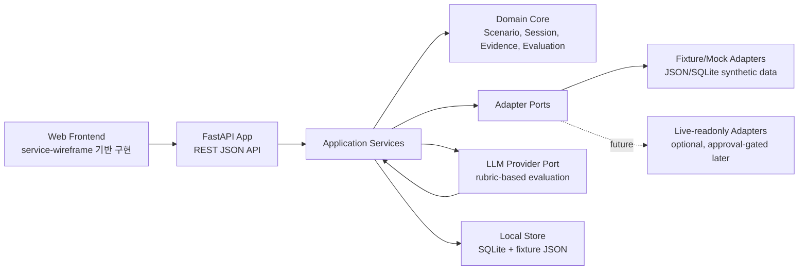

# 전체 서비스 아키텍처 설계

> 상태: BLUEPRINT 6 완료 기준
> 최종 업데이트: 2026-07-04 KST
> 기반 문서: `API_SPEC.md`, `SYSTEM_ARCHITECTURE.md`, `INTEGRATION_ADAPTERS.md`, `DYNAMIC_EVALUATION_RUBRIC.md`
> 구현 전제: 핵심 API 서버와 서버 로직은 Python FastAPI로 구현

> 2026-07-05 추가 결정: 다음 구현 스프린트는 `MODE_REDESIGN_CYBER_DEFENSE_DASHBOARD_HELPDESK.md`의
> 3모드 구조를 따른다. 기존 Operations service/repository는 `사이버 방호 대시보드` read model과
> `헬프데스크 모드` conversation API의 공통 기반으로 재사용한다.

## 1. 아키텍처 목표

`Cyber Defense Readiness Simulator`는 훈련 시뮬레이터와 보안 관제 조직 업무 보조를 별도 제품으로 나누지 않는다.

목표 구조:

```text
Training UI / Operations UI
  -> FastAPI Backend
  -> Shared Application Services
  -> Domain Core
  -> Integration Adapter Ports
  -> Fixture/Mock/Live-readonly Adapters
```

핵심 품질:

- 한 시나리오의 end-to-end demo가 끊기지 않아야 한다.
- Training Mode와 Operations Mode는 evidence, adapter, evaluation, report model을 공유해야 한다.
- 모든 fixture는 public-safe synthetic/masked 데이터여야 한다.
- LLM은 평가와 문장 생성을 돕지만, 근거 없는 결론이나 실제 조치 실행을 하지 않는다.
- FastAPI는 API delivery layer이고, 핵심 판단/시나리오/평가 로직은 domain/application service로 분리한다.

## 2. 런타임 구성



MVP 배포 단위:

| 컴포넌트 | 역할 | MVP 선택 |
|---|---|---|
| Web Frontend | 화면 01-06 구현, API 호출 | 정적 SPA 또는 단순 Vite/React |
| FastAPI App | API router, request validation, response envelope | 필수, `uv` + backend Docker container |
| Application Services | scenario/session/equipment/evaluation orchestration | 필수 |
| Domain Core | dataclass/Pydantic model, business rule | 필수 |
| Fixture Store | synthetic 시나리오, 로그, NAC, AV, 지시사항, ThreatIntel | 필수 |
| SQLite Store | session, pinned evidence, assessment, action, AAR 저장 | 권장 |
| LLM Provider | dynamic evaluation/report wording | fixture fallback 포함 |

Backend dependency/runtime 기준:

- Python 의존성의 source of truth는 `pyproject.toml`과 `uv.lock`이다.
- `requirements.txt`는 uv를 쓰기 어려운 도구를 위한 legacy compatibility 파일이다.
- 백엔드는 루트 `Dockerfile`로 별도 컨테이너 실행이 가능해야 한다.
- 컨테이너 기본 storage는 SQLite이며, PostgreSQL은 `D4D_STORAGE_BACKEND=postgres`, `D4D_DATABASE_URL`로 전환한다.

## 3. 백엔드 패키지 구조

권장 파일 배치:

```text
src/
  d4d/
    api/
      main.py
      dependencies.py
      errors.py
      response.py
      routers/
        training_home.py
        scenarios.py
        training_sessions.py
        equipment.py
        evidence.py
        assessment.py
        actions.py
        evaluation.py
        aar.py
        ops_cases.py
        adapters.py
    application/
      training_home_service.py
      scenario_catalog_service.py
      mission_session_service.py
      scenario_clock.py
      equipment_query_service.py
      evidence_ledger_service.py
      assessment_service.py
      action_submission_service.py
      dynamic_evaluation_service.py
      aar_service.py
      ops_case_service.py
      adapter_status_service.py
    domain/
      scenario.py
      session.py
      inject.py
      evidence.py
      assessment.py
      action.py
      evaluation.py
      aar.py
      ops_case.py
      enums.py
    ports/
      identity_port.py
      nac_port.py
      utm_firewall_port.py
      directive_port.py
      topology_port.py
      threat_intel_port.py
      llm_evaluator_port.py
    adapters/
      fixture_store.py
      fixture_identity.py
      fixture_nac.py
      fixture_utm_firewall.py
      fixture_directive.py
      fixture_topology.py
      fixture_threat_intel.py
      live_readonly/
        README.md
    repositories/
      scenario_repository.py
      session_repository.py
      evidence_repository.py
      aar_repository.py
      ops_case_repository.py
    safety/
      redaction.py
      sensitive_patterns.py
      audit_log.py
    fixtures/
      scenarios/
      equipment/
      rubrics/
      stealthmole/
tests/
  contract/
  e2e/
  unit/
  fixtures/
```

기존 `src/d4d/collect_stealthmole.py`, `src/d4d/scenario.py`, `src/d4d/report.py`는 초기 스크립트 자산으로 유지하되, API 서버 구현 시 다음처럼 흡수한다.

| 기존 파일 | 흡수 위치 |
|---|---|
| `scenario.py` | `domain/scenario.py`, `repositories/scenario_repository.py`, fixture generator |
| `report.py` | `application/aar_service.py`, `application/ops_case_service.py` |
| `collect_stealthmole.py` | `adapters/fixture_threat_intel.py`, future `adapters/live_readonly/stealthmole.py` |
| `config.py` | `api/dependencies.py`, `adapters/fixture_store.py` |

## 4. FastAPI 라우터 경계

각 router는 `API_SPEC.md`의 endpoint를 그대로 담당한다.

| Router | Endpoints | Service |
|---|---|---|
| `training_home.py` | `GET /api/training/home` | `TrainingHomeService` |
| `scenarios.py` | `GET /api/scenarios`, `GET /api/scenarios/{scenario_id}` | `ScenarioCatalogService` |
| `training_sessions.py` | `POST /api/training/sessions`, `GET /api/training/sessions/{session_id}`, `GET /api/training/sessions/{session_id}/events` | `MissionSessionService` |
| `equipment.py` | `POST /api/training/sessions/{session_id}/equipment/query` | `EquipmentQueryService` |
| `evidence.py` | `POST /api/training/sessions/{session_id}/evidence/pins` | `EvidenceLedgerService` |
| `assessment.py` | `PUT /api/training/sessions/{session_id}/assessment` | `AssessmentService` |
| `actions.py` | `POST /api/training/sessions/{session_id}/actions` | `ActionSubmissionService` |
| `evaluation.py` | `POST /api/training/sessions/{session_id}/evaluation/preview` | `DynamicEvaluationService` |
| `aar.py` | `POST /api/training/sessions/{session_id}/aar`, `GET /api/training/sessions/{session_id}/aar` | `AARService` |
| `ops_cases.py` | `POST /api/ops/cases/from-training-session` | `OpsCaseService` |
| `adapters.py` | `GET /api/adapters/status` | `AdapterStatusService` |

Router 책임:
- request parsing.
- response envelope 적용.
- domain/application exception을 API error envelope으로 변환.
- 인증/권한은 MVP에서는 stub으로 두되 interface를 남긴다.

Router가 하지 않는 일:
- fixture 파일 직접 읽기.
- vendor-specific API 호출.
- rubric 평가 로직 수행.
- raw threat-intel response 반환.

## 5. Application Service 책임

### 5.1 TrainingHomeService

입력:
- 사용자 역할 또는 demo user ID.

출력:
- 추천 시나리오.
- 최근 AAR.
- 숙련도 요약.

구현:
- `ScenarioCatalogService`와 `AARRepository`를 조합한다.
- MVP에서는 fixture summary를 반환한다.

### 5.2 ScenarioCatalogService

책임:
- 시나리오 목록/상세 조회.
- briefing view model 생성.
- hidden ground truth 제거.
- rubric summary만 노출.

주요 메서드:
- `list_scenarios(filters)`.
- `get_briefing(scenario_id)`.
- `get_dynamic_rubric(scenario_id)`는 내부 서비스 전용.

### 5.3 MissionSessionService

책임:
- 세션 생성.
- 시나리오 clock 관리.
- visible inject 계산.
- session state 조회.

상태 전이:

```text
briefing
  -> running
  -> submitted
  -> aar_ready
  -> closed
```

규칙:
- hidden inject는 API로 반환하지 않는다.
- 이벤트는 `elapsed_seconds`와 `visible_after_seconds` 기준으로 노출한다.
- demo reset이 필요하면 fixture seed를 고정한다.

### 5.4 EquipmentQueryService

책임:
- `port`, `query_type`, `query`를 받아 adapter registry에 위임.
- adapter result를 `Evidence[] + view_model`로 반환.
- query event를 session audit trail에 저장.

흐름:

```text
equipment/query
  -> validate session running
  -> AdapterRegistry.resolve(port, mode)
  -> adapter.query(context, query_type, query)
  -> RedactionService.assert_safe(evidence)
  -> EvidenceLedgerService.record_discovered(evidence)
  -> return evidence + view_model
```

중요:
- `utm_firewall`, `nac`, `directive`, `threat_intel`은 같은 service path를 사용한다.
- vendor-specific 필드는 adapter 내부에서만 다룬다.

### 5.5 EvidenceLedgerService

책임:
- discovered evidence 저장.
- pinned evidence 저장.
- evidence citation 검증.
- AAR/evaluation에서 evidence ID를 resolve.

구분:

| 상태 | 의미 |
|---|---|
| discovered | 장비 조회 결과로 세션에 노출됨 |
| pinned | 훈련생이 직접 조사 노트에 추가 |
| cited | assessment/action/report/evaluation에서 인용 |
| missed | scenario ground truth에는 있으나 훈련생이 확인하지 않음 |

### 5.6 AssessmentService

책임:
- 우선순위, 심각도, 대응 노력 판단 저장.
- assessment와 evidence ID 일관성 검증.

검증:
- `severity=suspected_compromise`이면 최소 하나의 security-event 또는 directive/threat-intel evidence가 필요하다.
- `critical_compromise_possible`은 MVP 시나리오에서 추가 근거 없이는 warning을 반환한다.
- `approval_required_action`이 있으면 action submission에서 approval flag를 요구한다.

### 5.7 ActionSubmissionService

책임:
- 훈련생 대응 제출 저장.
- action별 evidence ID 검증.
- approval-required proposal 생성.
- 세션 상태를 `submitted`로 전환.

금지:
- 실제 방화벽 정책 변경 실행.
- 실제 단말 격리 실행.
- 실제 계정 초기화 실행.

### 5.8 DynamicEvaluationService

책임:
- scenario rubric + session state + action timeline + evidence ledger로 동적 평가 생성.
- 미션 데스크용 preview와 AAR용 final 평가를 구분.
- LLM provider 실패 시 deterministic fallback을 제공.

입력 조립:

```text
scenario objective
visible inject timeline
hidden ground truth summary for evaluator only
equipment query audit
pinned evidence
assessment
submitted actions
rubric
safety constraints
```

출력:
- rubric hits/misses.
- priority/severity/effort feedback.
- evidence citations.
- confidence.
- `needs_more_evidence` 상태.

LLM 사용 원칙:
- raw sensitive data는 prompt에 넣지 않는다.
- prompt에는 synthetic/masked evidence만 넣는다.
- 출력은 JSON schema로 제한한다.
- 모든 평가 문장은 evidence ID 또는 `근거 부족` 라벨을 가져야 한다.

### 5.9 AARService

책임:
- dynamic evaluation final 생성 또는 조회.
- timeline replay 생성.
- checked/missed evidence 계산.
- next drill 추천.
- operations reuse hint 생성.

규칙:
- AAR은 punishment가 아니라 coaching artifact다.
- score가 없어도 timeline/evidence/feedback은 생성되어야 한다.

### 5.10 OpsCaseService

책임:
- training session evidence를 operations case draft로 변환.
- operator note, user guidance, policy request draft, daily report paragraph 생성.

중요:
- Operations Mode는 shared-core proof다.
- MVP에서는 `from-training-session`만 구현해도 충분하다.

## 6. Domain Core

Domain model은 API response model과 1:1로 같을 필요는 없다. 내부 domain은 평가와 재사용에 필요한 불변 규칙을 가진다.

핵심 aggregate:

| Aggregate | 포함 객체 | 불변 규칙 |
|---|---|---|
| `Scenario` | briefing, injects, ground truth, dynamic rubric | hidden ground truth는 UI response로 노출 금지 |
| `MissionSession` | status, clock, visible events, audit trail | submitted 이후 action 수정 금지 |
| `EvidenceLedger` | discovered, pinned, cited evidence | raw_available 기본 false, redaction 필수 |
| `Assessment` | priority, severity, effort, rationale | evidence IDs는 현재 session evidence여야 함 |
| `SubmittedActionSet` | user guidance, policy request, report | write-like action은 approval_required |
| `DynamicEvaluation` | rubric hits/misses, feedback, citations | citation 없는 단정 금지 |
| `AAR` | replay, evidence summary, evaluation, next drills | missing evidence는 blame이 아니라 coaching note |
| `OpsCase` | operator note, recommendation drafts | real execution 없음 |

## 7. Adapter Registry

`AdapterRegistry`는 `source_port + mode`로 adapter를 resolve한다.

```text
AdapterRegistry
  nac.fixture -> FixtureNacAdapter
  utm_firewall.fixture -> FixtureUtmFirewallAdapter
  directive.fixture -> FixtureDirectiveAdapter
  threat_intel.fixture -> FixtureThreatIntelAdapter
  threat_intel.live_readonly -> future StealthMoleReadonlyAdapter
```

공통 adapter contract:

| 필드/메서드 | 설명 |
|---|---|
| `port_name` | `nac`, `utm_firewall` 등 |
| `mode` | fixture/mock/live_readonly/live_approval_gated |
| `health()` | adapter 상태 |
| `query(context, query_type, query)` | evidence와 view model 반환 |

AdapterContext:

| 필드 | 설명 |
|---|---|
| `session_id` | training session ID |
| `case_id` | operations case ID, optional |
| `mode` | adapter mode |
| `requester_role` | trainee/operator/instructor/system |
| `redaction_level` | demo/internal/strict |

## 8. Fixture 데이터 구조

권장 fixture 배치:

```text
src/d4d/fixtures/
  scenarios/
    scen-main-outbound-001.json
  rubrics/
    scen-main-outbound-001.v1.json
  equipment/
    utm_firewall_logs.json
    firewall_policies.json
    directives.json
    nac_nodes.json
    nac_static_ip_ledger.json
    topology.json
  stealthmole/
    main_demo_sanitized_run.json
```

Fixture 최소 조건:
- `scen-main-outbound-001` 하나는 완성한다.
- `nac_nodes.json`은 대규모 synthetic 메타데이터와 핵심 노드 `nac-node-10243`을 포함한다.
- TrusGuard형 로그에는 `FW-20260704-0182`를 포함한다.
- Directive에는 `directive-2026-071`과 missing blacklist scope를 포함한다.
- ThreatIntel fixture는 raw credential 없이 masked summary만 포함한다.

## 9. 저장소 선택

MVP:
- scenario/equipment/rubric은 JSON fixture.
- session/evidence/action/assessment/AAR은 SQLite.
- application service는 DB를 직접 호출하지 않고 repository port를 통해 저장소를 사용한다.

이유:
- 데모 reset이 쉽다.
- 파일 fixture는 리뷰와 수정이 빠르다.
- 세션 상태는 관계형으로 저장해야 AAR replay가 쉽다.

구현 상태:

| 계층 | 현재 구현 | 확장 |
|---|---|---|
| Port | `MissionSessionRepository` | session/evidence/action/AAR/ops case 저장 계약 |
| Local adapter | `SQLiteMissionSessionRepository` | 개발·테스트 기본값, `D4D_SQLITE_PATH`로 파일 지정 |
| Deployment adapter | `PostgresMissionSessionRepository` | `D4D_STORAGE_BACKEND=postgres`, `D4D_DATABASE_URL`로 연결 |
| Test fallback | `InMemoryMissionSessionRepository` | 좁은 단위 테스트용, 기본값 아님 |

기본 실행은 `sqlite`이며 `data/runtime/readiness.sqlite3`에 저장한다. 이 경로는 git에 포함하지 않는다.

권장 테이블:

| 테이블 | 주요 컬럼 |
|---|---|
| `training_sessions` | `session_id`, `scenario_id`, `status`, `started_at`, `elapsed_seconds`, `mode` |
| `session_events` | `session_id`, `seq`, `event_id`, `visible_at_seconds`, `seen_at` |
| `evidence` | `evidence_id`, `session_id`, `source_port`, `source_id`, `claim`, `confidence`, `redaction`, `payload_json` |
| `evidence_pins` | `session_id`, `evidence_id`, `note`, `pinned_at` |
| `assessments` | `session_id`, `priority`, `severity`, `response_efforts_json`, `rationale`, `evidence_ids_json` |
| `submitted_actions` | `action_id`, `session_id`, `action_type`, `title`, `body`, `approval_required`, `evidence_ids_json` |
| `evaluations` | `evaluation_id`, `session_id`, `status`, `payload_json`, `created_at` |
| `aars` | `aar_id`, `session_id`, `score`, `grade`, `payload_json`, `created_at` |
| `ops_cases` | `case_id`, `source_session_id`, `status`, `payload_json`, `created_at` |

## 10. 주요 요청 흐름

### 10.1 임무 시작

```text
POST /api/training/sessions
  -> ScenarioCatalogService.get_scenario()
  -> MissionSessionService.create()
  -> SessionRepository.insert()
  -> initial visible events = []
  -> response TrainingSession
```

### 10.2 장비 조회

```text
POST /api/training/sessions/{id}/equipment/query
  -> MissionSessionService.require_running()
  -> EquipmentQueryService.query()
  -> AdapterRegistry.resolve(port, mode)
  -> FixtureAdapter.query()
  -> RedactionService.validate()
  -> EvidenceLedgerService.record_discovered()
  -> response evidence + view_model
```

### 10.3 대응 제출

```text
POST /api/training/sessions/{id}/actions
  -> AssessmentService.require_present_or_warn()
  -> EvidenceLedgerService.validate_citations()
  -> ActionSubmissionService.save()
  -> MissionSessionService.mark_submitted()
  -> response submitted_actions
```

### 10.4 AAR 생성

```text
POST /api/training/sessions/{id}/aar
  -> MissionSessionService.require_submitted()
  -> DynamicEvaluationService.evaluate_final()
  -> AARService.build_replay()
  -> AARRepository.save()
  -> MissionSessionService.mark_aar_ready()
  -> response AAR summary
```

## 11. 동적 LLM 평가 아키텍처

Provider port:

| 메서드 | 설명 |
|---|---|
| `evaluate_session(input)` | final AAR 평가 |
| `preview_session(input)` | 미션 데스크 하단 상태 평가 |
| `health()` | provider 사용 가능 여부 |

구현체:

| 구현체 | 용도 |
|---|---|
| `FixtureEvaluator` | API 키 없이 deterministic coaching output 반환 |
| `LLMEvaluator` | rubric/evidence 기반 동적 평가 |

LLM prompt input은 다음 JSON view만 받는다.

```json
{
  "scenario": {
    "scenario_id": "scen-main-outbound-001",
    "objective": "동시다발 사이버방호 이벤트 triage"
  },
  "rubric": {
    "version": "v1",
    "priority_guidance": ["서비스 장애와 의심 outbound 병행 처리"],
    "severity_guidance": ["정책 제한 + 의심 침해가 적정 결론"],
    "effort_guidance": ["즉시 안내와 승인 필요 조치 분리"]
  },
  "session_state": {
    "events_seen": ["evt-ticket-001", "evt-fw-0182"],
    "equipment_opened": ["utm_firewall", "nac"],
    "pinned_evidence_ids": ["fw-log-0182", "nac-node-10243"]
  },
  "assessment": {
    "priority": "parallel_triage",
    "severity": "suspected_compromise",
    "response_efforts": ["quick_guidance", "approval_required_action"]
  },
  "safety_constraints": [
    "cite evidence IDs",
    "do not infer raw sensitive data",
    "mark insufficient evidence explicitly"
  ]
}
```

LLM output은 `DynamicEvaluation` schema로 parse한다. parse 실패 시:
- raw text를 사용자에게 보여 주지 않는다.
- `FixtureEvaluator` fallback을 사용한다.
- warning `EVALUATION_FALLBACK_USED`를 남긴다.

## 12. 안전 및 Redaction

`RedactionService`는 모든 adapter result, LLM input, report/AAR output에 적용한다.

검사 대상:
- API key, secret, JWT.
- raw credential.
- 실제 이메일/전화번호/식별번호 유사 패턴.
- 실제 네트워크 주소처럼 보이는 값.
- offensive step-by-step content.

정책:
- 차단 가능하면 error `REDACTION_REQUIRED`.
- demo fixture에서는 위반이 발견되면 테스트 실패.
- LLM prompt에는 sanitized evidence만 전달.
- `raw_available=false`가 기본이며 raw payload 저장 금지.

## 13. 프론트엔드 연동 구조

화면은 `wireframes/service-wireframe.html`의 6개 screen을 구현 순서로 삼는다.

권장 클라이언트 상태:

| 상태 | 설명 |
|---|---|
| `scenarioCatalog` | 02 화면 목록 |
| `selectedScenario` | 03 브리핑 |
| `session` | 실행 중 세션 |
| `events` | 상황 피드 |
| `equipmentViews` | port별 최근 query view model |
| `evidenceLedger` | discovered/pinned evidence |
| `assessment` | 우선순위/심각도/대응 노력 |
| `submittedActions` | 대응 제출 |
| `aar` | AAR 리플레이 |

원칙:
- 프론트엔드는 adapter fixture 파일을 직접 읽지 않는다.
- 프론트엔드는 evidence ID를 사용자에게 노출하되 raw data는 표시하지 않는다.
- 목업 장비 화면은 `equipment/query`의 `view_model`로 렌더한다.

## 14. 테스트 전략

### Unit

| 대상 | 테스트 |
|---|---|
| `ScenarioClock` | elapsed time에 따른 visible event 계산 |
| `EvidenceLedgerService` | discovered/pinned/cited/missed 상태 |
| `AssessmentService` | severity/evidence consistency warning |
| `RedactionService` | secret/raw credential 패턴 차단 |
| Fixture adapters | query별 expected evidence 반환 |

### Contract

`architecture/API_SPEC.md`의 mock request/response를 기준으로:
- response envelope shape.
- error envelope shape.
- required fields.
- enum values.

### E2E

고정 scenario seed로 다음을 검증한다.

```text
GET home
GET scenarios
GET scenario detail
POST session
GET events
POST equipment/query utm_firewall
POST evidence/pins
POST equipment/query nac
PUT assessment
POST evaluation/preview
POST actions
POST aar
GET aar
POST ops/cases/from-training-session
```

성공 조건:
- AAR grade/summary 생성.
- checked evidence에 `fw-log-0182`, `nac-node-10243` 포함.
- missed/late evidence에 `directive-2026-071` 또는 단말 posture 보강 포인트 포함.
- dynamic evaluation에 priority/severity/effort feedback 존재.
- raw sensitive data 없음.

## 15. 구현 순서

1. FastAPI app skeleton과 공통 response/error envelope.
2. Scenario/equipment/rubric fixture 작성.
3. ScenarioCatalogService와 MissionSessionService.
4. Fixture adapters: UTM/FW, NAC, Directive, ThreatIntel.
5. EquipmentQueryService와 EvidenceLedgerService.
6. AssessmentService와 ActionSubmissionService.
7. DynamicEvaluationService fixture fallback.
8. AARService.
9. OpsCaseService thin reuse path.
10. Frontend 6-screen flow 연결.
11. Redaction/contract/e2e tests.

## 16. BLUEPRINT 6 완료 기준 체크

| 기준 | 상태 |
|---|---|
| API 스펙 기반 router/service 경계 정의 | 완료 |
| FastAPI backend core 전제 반영 | 완료 |
| shared core와 adapter port 구조 정의 | 완료 |
| Training/Operations 중복 최소화 구조 정의 | 완료 |
| scenario/evidence/evaluation/AAR 저장 구조 정의 | 완료 |
| 동적 LLM 평가와 fallback 설계 | 완료 |
| 안전/redaction/test 전략 정의 | 완료 |
| 모듈 개발 직전 수준의 구현 순서 정의 | 완료 |
